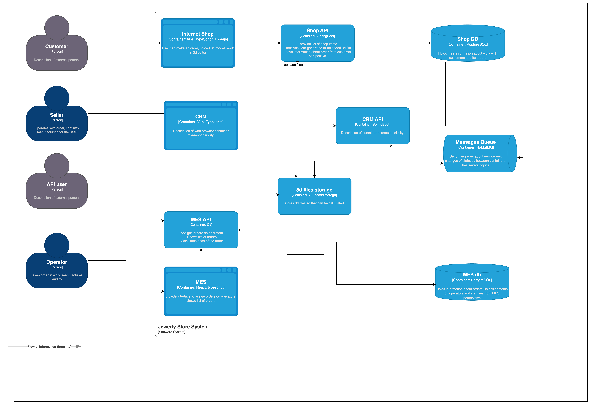

# Выбор и настройка мониторинга в системе»



## Мотивация 
Мониторинг необходим, чтобы разработчики могли видеть, как реально работает их система в продакшене. 
Без него невозможно понять, функционирует ли программа корректно, 
насколько быстро она отвечает и возникают ли ошибки. Без мониторинга в целом опасно работать в проде - понять это только по логам и обращениям пользователей, 
крайне проблематично и не дает полной видимости и узких мест системы.

## Выбор подхода к мониторингу

Для разных частей системы будем применять разные подходы к мониторингу. 
### USE
Подход USE будем применять к Базам данных (postgres, S3, redis) и брокерам сообщений.

Какие lablels будем навешивать

```declarative
resource:     тип ресурса (cpu, memory, disk, network)
container:    название контейнера
instance:     IP:порт или hostname
env:          окружение
```

#### U - usage 
- CPU Usage БД и брокеров. Обычно после достижения 80% CPU (личный опыт автора) система уже начинает деградировать 
- RAM Usage БД и брокеров. Оперативаня память используемая БД или брокером 
- Disk Iops - количество операция дискового ввода-вывода
- Disk Usage - количество свободного пространства на диске.

#### S - saturation
- Connection queue length - количество ожидаемый подключений. Особенно актуально для postgres и redis, так как количество connection ов сильно ограничено. И время ожидания connection будет >>> время исполнения запроса
- Deadlocks - для БД. сигнализирует о блокировках и потенциальных deadlock'ах.
- Disk queue length - размер очереди ожидания на чтения с диска.  Насколько долго запросы к диску ждут исполнения.
- Queue Lag - размер очереди для брокера сообщения

#### E - Errors 
- Количество Fatal/Error в бд. Показывает сколько запросов фейлится с критическими ошибками
- Количество таймаутов на выполнение SQL запросов. 
- Количество NACK от consumer ов сообщения
- Ошибки репликации

### 4 golden signals
4 golden signals  предлагается использовать непосредственно в backend сервисах: Shop-API, MES-API, CRM-API

Какие labels будем навешивать 

```
method:       HTTP метод (GET, POST)
handler:      URI, эндпоинт или имя контроллера (например, /users/{id})
status_code:  HTTP код ответа (200, 500 и т.д.)
service:      Название микросервиса
instance:     IP:порт или hostname сервиса
env:          Окружение (prod, staging)
cluster:      Кластер в котором развернут под микросервиса
```

#### Request 
- Total RPS - суммарное количетсво RPS, которое поступает на сервис
- RPS с разбивкой по handler ам - для отслеживания, какие ручки дают наибольшую нагрузку
- Исходящий RPS - какой RPS даем на другие сервисы
- Трафик к БД. Как часто обращаемся к БД
- Количество обрабатываемых сообщений из брокера сообщений. Для проверки с каим лагом мы готовы справиться 
- Количество отправляемых сообщений в брокер.

###  Errors
- 5xx RPS - количество 500 ок в сервисе. Идеальное значение 0. 500 ое ошибки сигнаоизируют о серьезных ошибках в сервисе.
- 4xx RPS - количество 400 ок в сервисе. Какие клиенты передают неправильые данные. 
- Cache hit/miss rate - промахи или попадания в кэш для сервиса. Для индикации насколько правильно вообще работает кэщ

### Latency
- Время выполнения запроса к сервису
- Время выполнения исходящего запроса 
- Время выполнения SQL запроса

### Saturation 
- CPU Usage - backend сервисов. При большом потреблении - необходимо будет скейлиться
- RAM usage - backend сервисов. При большом потреблении - необходимо будет скейлиться


## План действий

1. [Devops] Развернуть инстанс Grafana в Yandex cloud
2. [DevOps] Развернуть Prometheus в yandex cloud с помощью [Prometheus operator](https://console.yandex.cloud/folders/b1gubmvie8oc3uie1d88/marketplace/products/f2eag5jtufht5jaefnih)
3. [Dev Team] Добавить Golden signals метрики описанные в документе во все backend сервисы 
4. [Devops] Настроить интеграцию Postgres и Rabbit MQ с prometheus 
5. [Dev Team] Настроить Grafana dashboards 
6. [Devops]  Настроить алертинг

## Метрики насыщенности 
1. При превышении относительного количества 5XX ошибок отностительно всего количества запросов больше чем на 2%. Добавляем авто прозвон тим лида/дежурного разработчика
2. При превышении Latency запроса, на больше, чем установленный SLI 99%. Добавляем авто прозвон тим лида/дежурного разработчика
3. При Lag RabbitMQ > 10000 Messages => отправляем Email Devops + нотификация в чат команды разработки 
4. При RPS = 0, больше чем 1 минута, добавляем авто прозвон Devops + Teamlead
5. При CPU Usage в бд > 70%, заводим тикет на technical research от команды разработки с приоритетом high. Скоро достигнем потолка 
6. При RAM Usage в бд > 80% , заводим тикет на technical research от команды разработки с приоритетом high. Скоро достигнем потолка 