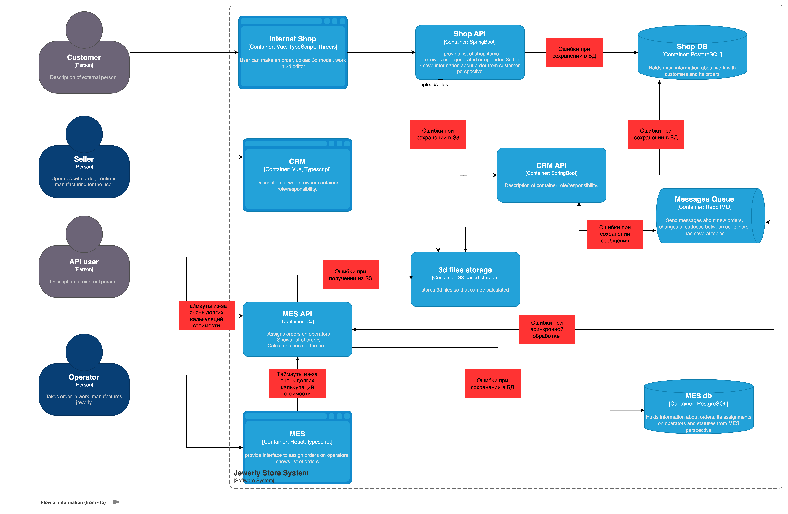

# Архитектурное решение по трейсингу

## Анализ проблем 

1. Самое потенциально опасное место это расчет стоимости изготовления. Его обязательно нужно покрыть трейсами. Трейсы будет прокидывать от обращений клиентов
2. Асинхронная обработка - опасное место, где что-то может пойти не так и операцию нужно докатывать в ручную. Покроем все взаимодействия с RabbitMQ трейсами
3. Походы в БД. Система потенциально может сломаться на походах в Базу данных, все взаимодействия с БД также нужно покрыть трейсами.

## Мотивация 
Трейсинг поможет быстрее детектировать проблемы и находить, где зависает заказ.
Конкретные метрики, на которые повлияет внедрение метрик:
1. Бизнес-метрика. Сокращение ожидания заказа. Разработчики смогут быстрее находить заказы в зависших статусах и "доталкивать" статус в ручную, если необходимо, вызывая нужные API, прокидывая  события или изменяя статусы в базе
2. Техническая метрика. Errors RPS. Трейсинг поможет найти самые проблемные места в бизнес-сценариях и взять в ресерч задачи на фикс проблемных мест
3. Техническая метрика. Request Duration. С помощью трейсинга сможем определить какие запросы и этапы занимают больше всего времени, для дальнейшей оптимизации и сокращения количества таймаутов и времени ожидания запросов.
4. Техническая метрика. Graceful Degradation. С  помощью трейсинга и визуализации запроса, сможем понять, какие запросы могут быть покрыты Graceful degradation, чтобы не прерывать флоу бизнес сцеанрия. Можем либо игнорировать ошибки в  таких запросах, либо закрыть кешом и мимнимизировать количество таких вызовов.

## План Действий

1. [Devops] Разворачиваем инстанc OTel Collector для приема и аггрегации трейсов и дальнейшей их отправки в jaeger
2. [Devops] Разворачиваем инстанс Jaeger для визуализации и хранения трейсов
3. [Devops] Разворачиваем инстанc Keycloak для хранения credentials команды
4. [Devops] Разворачиваем инстанс Oauth2 Proxy
5. [Devops] Интеграция Oauth2 Proxy и Keycloak
6. [Devops] Интеграция Oauth2Proxy и Jaeger
3. [Dev-Team] Прописываем трейсы в сервисах MES API, Shop API, CRM API

## Компромиссы 

В целом можно временно обойтись без компонента OTel, так как он помогает в случае большого количества метрик и трейсов. 
В нашей небольшой системе можно слать напрямую в Jaeger. 
В первое время будет сложно насроить пропагацию контекста для event driven взаимодействий через RabbitMQ. Поэтому SPAN ами покроем только http вызовы и вызовы к базе

## Аспект безопасности
К сожалению, Jaeger не имеет встроенных механизмов аутентификации, и их нужно настраивать самостоятельно.
Для Production среды необходим в любом случае надежный способ хранения credentials, и настройка простого reverse proxy nginx с basic Auth.
Было принято решение пойти в связку Oauth2 Proxy + Keycloak + Jaeger. Oauth2 Proxy аутентифицирует доступ до Jaeger, а Keycloak выступает провайдером Oauth2