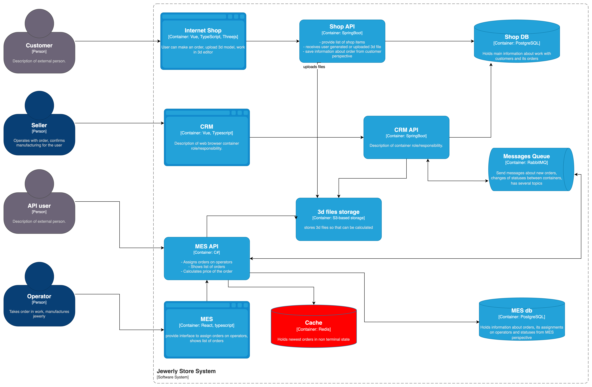
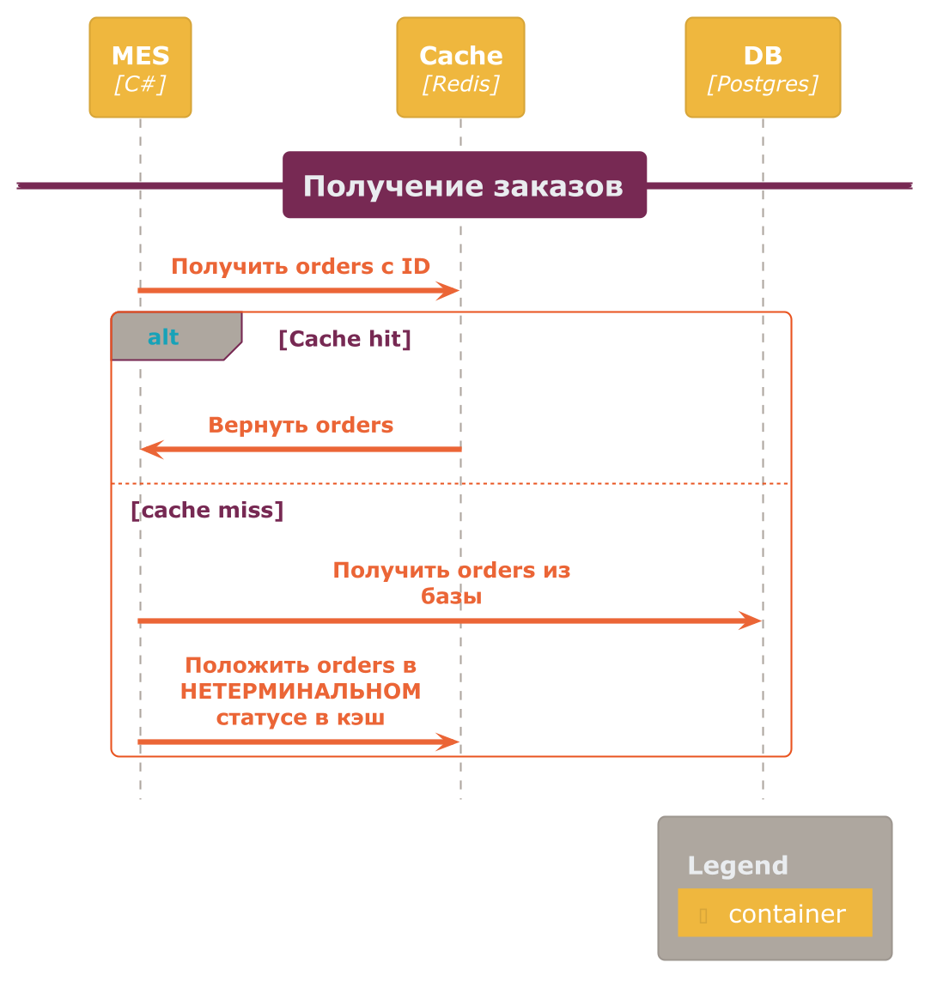
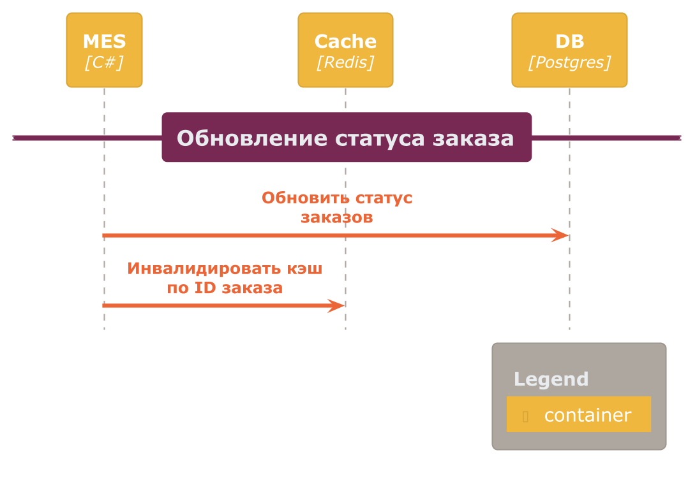

# Архитектурное решение по кешированию

В первую очередб необходимо закешировать MES API, так как оснновные жалобы поступают от ператоров, работающих с MES системой на долгую прогрузку заказов.


## Мотивация 
Для ускорения прогрузки сраницы с заказами в MES необходимо добавить кеш перед базой в MES API. Таким образом мы существенно ускорим прогрузку страницы свежих заказов, так как обращение к оперативной памяти (в которой хранится кеш) существенно быстрее чем обращение к диску, даже в случае индекса


```declarative
Latency Comparison Numbers (~2023)
----------------------------------
L1 cache reference                           0.5 ns
Branch mispredict                            5   ns
L2 cache reference                           7   ns                      14x L1 cache
Mutex lock/unlock                           25   ns
Main memory reference                      100   ns                      20x L2 cache, 200x L1 cache
Compress 1K bytes with Snappy            3,000   ns        3 µs
Read 1 MB sequentially from memory      20,000   ns       20 µs          ~50GB/sec DDR5
Read 1 MB sequentially from NVMe       100,000   ns      100 µs          ~10GB/sec NVMe, 5x memory
Round trip within same datacenter      500,000   ns      500 µs
Read 1 MB sequentially from SSD      2,000,000   ns    2,000 µs    2 ms  ~0.5GB/sec SSD, 100x memory, 20x NVMe
Read 1 MB sequentially from HDD      6,000,000   ns    6,000 µs    6 ms  ~150MB/sec 300x memory, 60x NVMe, 3x SSD
Send 1 MB over 1 Gbps network       10,000,000   ns   10,000 µs   10 ms
Disk seek                           10,000,000   ns   10,000 µs   10 ms  20x datacenter roundtrip
Send packet CA->Netherlands->CA    150,000,000   ns  150,000 µs  150 ms

```

## План действия 



Было выбрано использование серверного кеширования, без использования клиентского в MES системе. 
Клиентское мы  использовать не будем,  чтобы иметь актуальный статус заказа. Мы не хотим ситуацию, когда заказ уже был взят в работу кем-то из операторов, а другие операторы видят его, как свободный.

Поэтому мы будем использовать серверное кеширование и инвалидировать кеш при каждой смене статуса.
Было принято решение использовать классический cache-aside, так как мы хотим вручную инвалидировать cache при смене статуса заказа. 

Разберем несколько других паттернов, и почему они не подходят:
- ReadThrough и Refresh Ahead. Cache обновляется при истечении TTL. Нам не подходит, так как мы хотим класть только те заказы, которые находятся в нетерминальном статусе. А также вручную инвалидировать кэш 
- WriteThrough и WriteBehind. Могут быть ошибки при записи именения статуса в базе. Пользователи и так страдают из-за проблем зависших статусов, мы не хотим еще сильнее усугублять эту проблему.

### Сценарий получение заказов



### Сценарий обновления стаутса заказов



### Стратегия Инвалидации Кэша

| Способ Инвалидации                  | Почему подходит                                                                | Почему не подходит                                                                                                                                                                                                          |
| ----------------------------------- |--------------------------------------------------------------------------------|-----------------------------------------------------------------------------------------------------------------------------------------------------------------------------------------------------------------------------|
| Временная инвалидация               | -                                                                              | Необходимо всегда иметь актуальный статус заказа, чтобы два оператора по ошибке не взяли один и тот же заказ                                                                                                                |
| Инвалидация, основанная на запросах | Можно инвалидировать при каждом действии пользователя или оператора            | Есть статусы, которые меняются в неазивисимости от действий пользователя. Например, переход от статуса SUBMITTED до PRICE_CALCULATED происходит без участия пользователя                                                    |
| Инвалидация на основе изменений     | Оператором и пользователям всегда будет показываться статус изменения заказа   | Все равно большая нагрузка на базу, так как при каждом изменении статуса, а их всего 10, необходимо будет повторно обратиться к базе. + сложно контроллировать, так как инвалидация будет осуществляться за счет фреймворка |
| Программная инвалидация             | Полностью контроллиурем инвалидацию кэша на программном уровне. Гибкое решение | Большая вероятность ошибки, так как ответсвенность за инвалидацию всегда перекладываем на разрабочтика. Если он забудет его инвалидировать, то могут получится неконститентные данные                                       |
| Инвалидация по ключу                | Преимущества инвалидации на основе изменений + программной инвалидации.        | Опять же есть риск потерять процесс инвалидации при обновлении данных. Все изменения происходит вручную                                                                                                                     |

Я выбрал использовать инвалидацию на основе изменений, для нас критически важно всегда иметь актуальный статус заказа. Поэтому кэш будет инвалидироваться при каждом update в базе, и кэш будет очищаться средствами ORM